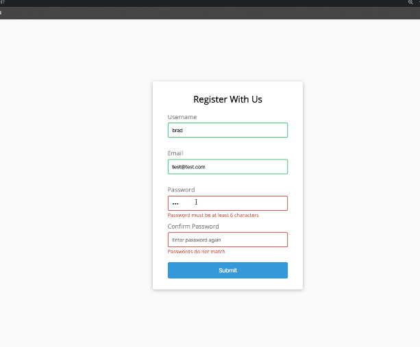
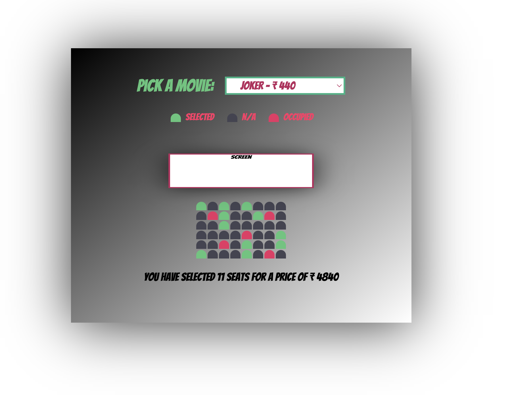

# Pure Js Projects

### Form Validator
- Concepts
    - Function as param.
    - Single Function for Validation.
    - 

### Movie Booking
- Concepts
    - Local Storage
    - Connect Matrix to Table and access Table index[row,col]
    - 