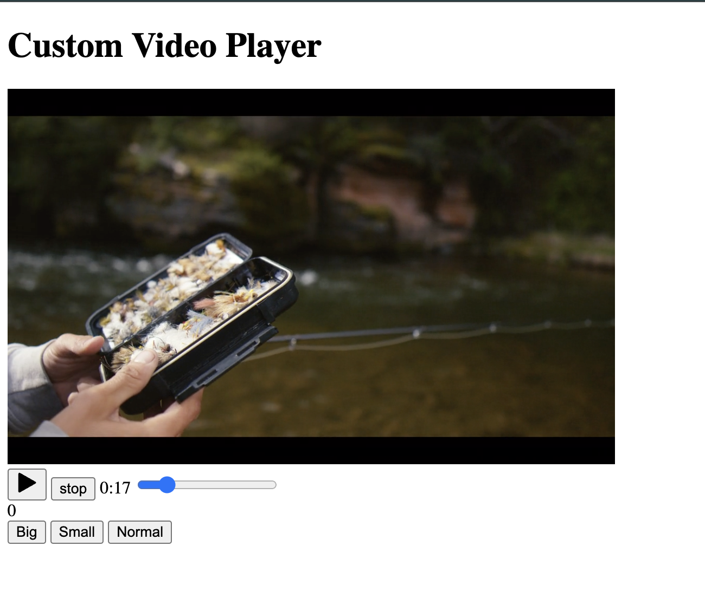

# Pure Js Projects

### Form Validator
- Concepts
    - Function as param.
    - Single Function for Validation.
    - 

### Movie Booking
- Concepts
    - Local Storage
    - Connect Matrix to Table and access Table index[row,col]
    - 

### Custom Video Player
- ** Ignored The CSS **
- Concepts
    - progressbar link to video
    - video ele prop
    - 

### Exchange Rate Calculator
- Concepts
    - Fetch API
    - Convertion logic
    - 